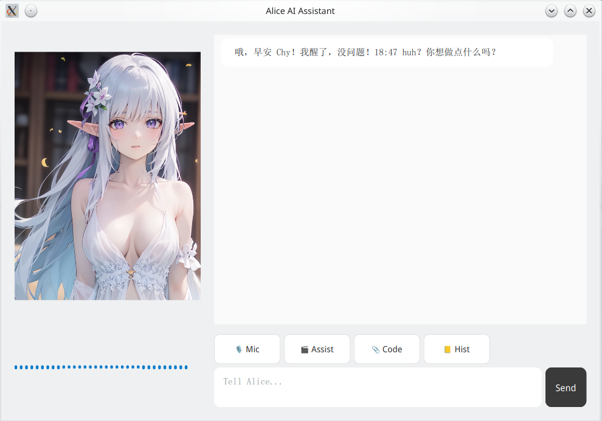

# AssistAlice

[中文](#中文)

AI agent as desktop application running in low physical resource.

Supports:
  - general chatting, also with high-level microphone voice ASR.
  - simple online searching.
  - low/medium level coding assisting (according to LLM model).
  - Synchronized video/audio watching (ASR with subtitle and LLM summarizing)
  - desktop pet mode with OSD subtitle

Base on:

[llama-cpp-python](https://github.com/abetlen/llama-cpp-python)

[sherpa-onnx](https://github.com/k2-fsa/sherpa-onnx)

PySide6 for application UI.



### Installation

Test on: Python 3.11

> A miniconda environment is advised.

1. `pip install -r requirements.txt`

    > Note: for better experience with llm, choose a backend of llama-cpp-python and install it before requirements.txt.

    - cpu (Pre-built Wheel)
        ```
        pip install llama-cpp-python \
        --extra-index-url https://abetlen.github.io/llama-cpp-python/whl/cpu
        ```

    - OpenBLAS (CPU)
        ```
        CMAKE_ARGS="-DGGML_BLAS=ON -DGGML_BLAS_VENDOR=OpenBLAS" pip install llama-cpp-python
        ```

    - CUDA
        ```
        CMAKE_ARGS="-DGGML_CUDA=on" pip install llama-cpp-python

        or Pre-built Wheel:
        CUDA Version is 12.1, 12.2, 12.3, 12.4 or 12.5

        pip install llama-cpp-python \
        --extra-index-url https://abetlen.github.io/llama-cpp-python/whl/<cuda-version>
        ```

    - hipBLAS (ROCm)
        ```
        CMAKE_ARGS="-DGGML_HIPBLAS=on" pip install llama-cpp-python
        ```

    - vulkan (recommended for AMD APU)
        ```
        CMAKE_ARGS="-DGGML_VULKAN=on" pip install llama-cpp-python

        or Pre-built Wheel:

        pip install llama-cpp-python \
        --extra-index-url https://abetlen.github.io/llama-cpp-python/whl/vulkan
        ```

    > Note: if in Linux, make sure PySide6 version is the same with your system package.
    Then use the following comand to enable fcitx.

    ```
    cp /usr/lib/qt6/plugins/platforminputcontexts/libfcitx5platforminputcontextplugin.so \
    [your miniconda dir]/env/[your env]/lib/[python version]/site-packages/PySide6/Qt/plugins/platforminputcontexts/
    ```

2. Download local model according to README files in directory [model].

3. Download browser driver for selenium according to README file in directory [driver].

    > You may want to use requests module for faster experience, change the function calling in custom_tools.py

4. then you can run app in the terminal with `python main.py`, or write a startup file to launch it.

### Configuration

You can customize another character setting in [config/system_prompt.txt].

Besides, there are options that you can add it to [config/setting.json].

optional:
- user_nick
- lang: en/ja/zh/zh_mix
- llm_cpu: Default to be 8 in a CPU env if not set. Set it larger for faster CPU reasoning; or set it smaller to work with n_gpu_layer option.
- n_gpu_layer: Offload model to GPU. Default not set.
- stt_cpu: CPU threads used for voice ASR. Default to be 2 if not set.
- tts_cpu: CPU threads used for TTS. Default not set.
- work_time: device monitor for work. Default to be 9:00 if not set.
- sleep_time: device monitor for sleep reminding. Default to be 23:30 if not set.

### Hotkey

- Alt+R: microphone listening
- Alt+C: get code from clipboard (Ctrl+C to copy code before used)
- Ctrl+Alt+C: quickly ask about code from clipboard.
- Alt+V: media assisting.

### Directory Tree

```
proj
    - core
    - ui
    - assets
    - model
    - driver (optional for browser online searching)
    - config
    - data
```

### Benchmarks
Ryzen 5800H, use 'n_gpu_layer=-1' to offload to GPU.
```
llama_perf_context_print: prompt eval time =     325.95 ms /    31 tokens (   10.51 ms per token,    95.11 tokens per second)
llama_perf_context_print:        eval time =    4193.84 ms /    68 runs   (   61.67 ms per token,    16.21 tokens per second)
llama_perf_context_print:       total time =    4549.80 ms /    99 tokens
```

Total: about 3.4GB

  - LLM: 2.6GB (Vulkan0 model buffer: 1918.35 MiB, CPU_Mapped model buffer: 308.23 MiB, Vulkan0 KV buffer: 119.00 MiB, Vulkan0 compute buffer: 262.50 MiB)
  - ASR: 300MiB
  - TTS: 400MiB

## 中文

一个适用于中低配机器的后台常驻的桌面应用级AI助手。

支持:
  - 普通对话式聊天，包括高质量的麦克风识别直接对话。
  - 简单的网络搜索。
  - 中/低水平的编程辅助（取决于LLM模型，配置较高比如32G内存设备可考虑配置Qwen-Coder-7B，能获得较好的体验）。
  - 音/视频的同步视听，字幕和总结（当前配置为英文，适用于各种TED、Online learnging课程的辅助学习）。
  - 桌宠模式，静默后台常驻。

### 安装

测试环境: Python 3.11

> 推荐使用miniconda进行安装避免依赖污染.

1. 执行`pip install -r requirements.txt`

    > 注：纯CPU环境可以直接按requirements.txt安装，其他环境建议先手动安装llama-cpp-python来获取更好的推理性能。

    - cpu (默认的预编译包)
        ```
        pip install llama-cpp-python \
        --extra-index-url https://abetlen.github.io/llama-cpp-python/whl/cpu
        ```

    - OpenBLAS (CPU加速，但会导致推理时CPU温度爆发式提升，新机器/定期涂硅脂的机器可选，老机器慎重)
        ```
        CMAKE_ARGS="-DGGML_BLAS=ON -DGGML_BLAS_VENDOR=OpenBLAS" pip install llama-cpp-python
        ```

    - CUDA（N卡独显）
        ```
        CMAKE_ARGS="-DGGML_CUDA=on" pip install llama-cpp-python

        or Pre-built Wheel:
        CUDA Version is 12.1, 12.2, 12.3, 12.4 or 12.5

        pip install llama-cpp-python \
        --extra-index-url https://abetlen.github.io/llama-cpp-python/whl/<cuda-version>
        ```

    - hipBLAS (A卡独显)
        ```
        CMAKE_ARGS="-DGGML_HIPBLAS=on" pip install llama-cpp-python
        ```

    - vulkan (AMD APU强烈推荐这个)
        ```
        CMAKE_ARGS="-DGGML_VULKAN=on" pip install llama-cpp-python

        or Pre-built Wheel:

        pip install llama-cpp-python \
        --extra-index-url https://abetlen.github.io/llama-cpp-python/whl/vulkan
        ```

    > 注2: Linux环境下需要保证conda安装的PySide版本与系统Qt环境一致，然后用以下命令配置fcitx的链接库才能进行中文输入。

    ```
    cp /usr/lib/qt6/plugins/platforminputcontexts/libfcitx5platforminputcontextplugin.so \
    [miniconda安装路径]/env/[conda环境]/lib/[python版本]/site-packages/PySide6/Qt/plugins/platforminputcontexts/
    ```

2. 按照model目录下的各个README文件下载离线模型。

3. 按照driver目录下的README文件下载用于selenium进行网络搜索的浏览器驱动

    > 如果觉得selenium太繁重太慢，代码中提供了更简单的request请求，可以直接修改custom_tools.py的函数调用。

4. 然后就可以在终端运行`python main.py`，或另外创建一个快捷方式来启动。

### 配置文件

你可以通过在`config/system_prompt.txt`自定义系统级提示词来设定另外一个AI人设。

另外，以下的配置项可以按需任意添加一个或多个到`config/setting.json`中。

可选配置项:
- user_nick: 用户名
- lang: 语言，en/ja/zh/zh_mix，推荐使用zh_mix中英混合。
- llm_cpu: LLM的推理线程数，不配置时默认为8。根据机器核心数，可调高配置来获取更好的CPU推理性能；启用n_gpu_layer时可适当调低。
- n_gpu_layer: 装载到GPU的层数，0为不使用GPU，-1为全部。默认不配置。APU机器GPU和CPU通过vulkan共享物理内存，只要内存够大，可无脑设置-1。
- stt_cpu: 声音识别的线程数，如果不配置则默认为2。
- tts_cpu: TTS语音的线程数，默认不配置。
- work_time: 输入设备监控的工作时间，如果不配置则默认9:00。
- sleep_time: 输入设备监控的睡眠提醒时间，如果不配置则默认23:30。

### 快捷键

- Alt+R: 麦克风监听
- Alt+C: 从剪切板获取代码进行提问（使用前先用Ctrl+C复制代码）
- Ctrl+Alt+C: 从剪切板获取代码并快捷提问（LLM自主检视）
- Alt+V: 同步视听辅助。

## License

This project is licensed under the terms of the GPLv3 license.

Use icons from Font Awesome Free, available under CC BY 4.0.
